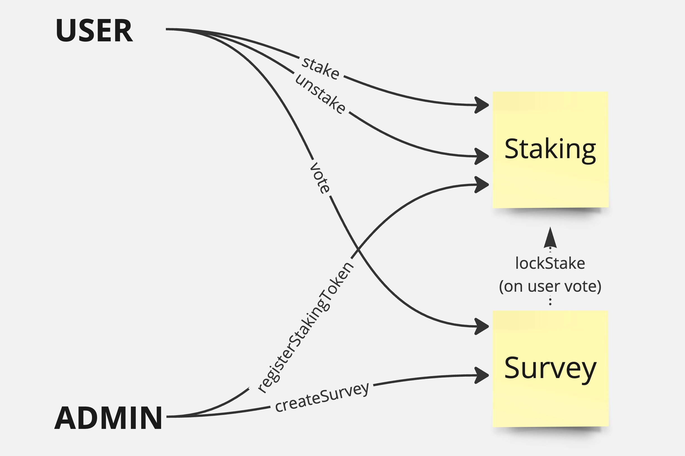

## Challenge 2:

The company wants to create a platform where users could stake their tokens. This will allow users
to participate in (vote) different Surveys. When a user stakes some amount of a particular token (ex: BAR) it
gives them the possibility to vote on any survey linked to that token (ie: BAR).

Design an upgradeable smart contracts architecture to tackle this challenge. Consider security risks and
maintainability.

Describe possible improvements. Eventually provide a diagram.

## Improvements:

- Write tests with high coverage !!!
- Allow vote updates if additional tokens have been staked
- UX improvements: integrate account abstraction (bundle approve + transferFrom; subsidize fees)

## Security Considerations:

- Implemented access control mechanisms to restrict certain functions to authorized users
- Implemented checks to prevent double voting

## Security risks

- keys associated with the roles must be safely guarded, especially the DEFAULT_ADMIN_ROLE and UPGRADER_ROLE (e.g. multisig)

## Maintainability

- role based upgradeable system
- responsibilities split accross different roles (e.g. upgradear, admin)

## Deployed on  Sepolia:

- [Staking](https://sepolia.etherscan.io/address/0xB85a634b0cBbD363c6aEf53765658a75C7DCAAad#readProxyContract)
- [Survey](https://sepolia.etherscan.io/address/0x2240A397Caf1686Da8C4251cDC14DD3802188EcD#readProxyContract)
